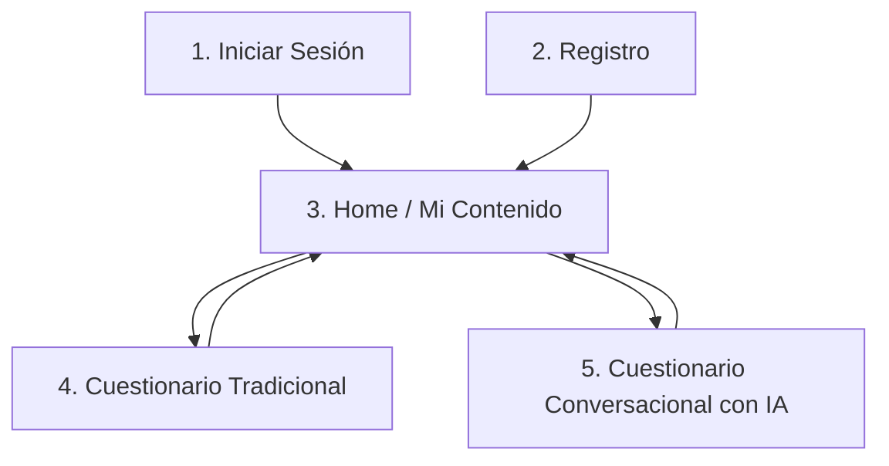
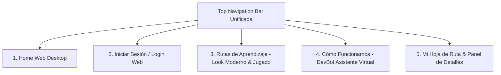
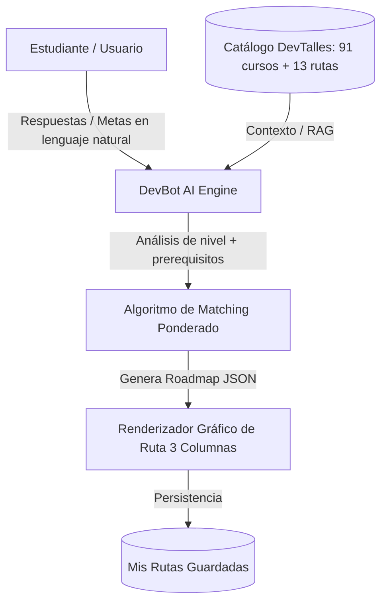

# Prototipo Móvil en Stitch: DevTalles CodeQuest 2026

Documentación técnica y enlaces del proyecto de diseño generado directamente en **Stitch** para el equipo **TechBrain** (Equipo #13).

---

## 1. Identificadores del Proyecto en Stitch

* **ID del Proyecto:** `14643612934649054340`
* **Nombre del Recurso:** `projects/14643612934649054340`
* **Título del Proyecto:** `DevTalles CodeQuest 2026 - Mobile App`
* **Sistema de Diseño:** `assets/9033636429044497341` (*DevTalles Cosmic Design System*)
* **Tema Aplicado:** Dark Mode Cósmico con paleta oficial (`#171027`, `#3a14c4`, `#c0b9fc`, `#c8dd09`) y tipografías `Space Grotesk` + `DM Sans`.
* **Dispositivo:** Mobile (390 x 844 / 390 x 1099 px)

---

## 2. Pantallas Generadas en Stitch

---

### 📱 Pantalla 1: Iniciar Sesión (`Login`)
* **ID de Pantalla en Stitch:** `7dec3239900546e9b929ae9c0bcb5342`
* **Dimensiones:** `390 x 884 px`
* **Captura Local:** [`stitch_screens/1_login.png`](file:///Users/fjbarrientos/Desktop/techBrain/stitch_screens/1_login.png)

#### Componentes Clave:
1. **Branding Superior:** Logotipo `{dev/talles}` en `Space Grotesk` con llaves glowing y mascota robótica.
2. **Acceso Social Mandatario:** Botón prominente de **Iniciar sesión con Discord** en forma de píldora (`#5865F2`), cumpliendo con los lineamientos del CodeQuest.
3. **Formulario de Correo:** Tarjeta translúcida con glassmorphism, inputs para correo y contraseña con icono de visibilidad, enlace "¿Olvidaste tu contraseña?" y casilla "Recordarme".
4. **Botón Principal:** "Iniciar Sesión" con gradiente morado eléctrico (`#4725af` ➔ `#3a14c4`) y resplandor difuso.
5. **Footer:** Enlace directo a la pantalla de registro.

---

### 📱 Pantalla 2: Registro (`Crear Cuenta`)
* **ID de Pantalla en Stitch:** `2421a89bb0b34f6b91d6d3a68c29f614`
* **Dimensiones:** `390 x 982 px`
* **Captura Local:** [`stitch_screens/2_registro.png`](file:///Users/fjbarrientos/Desktop/techBrain/stitch_screens/2_registro.png)

#### Componentes Clave:
1. **Top Bar:** Flecha de retorno y mini isotipo DevTalles.
2. **Registro Rápido con Discord:** Permite autocompletar el perfil mediante OAuth2.
3. **Campos Específicos para CodeQuest:**
   - **Nombre completo.**
   - **Discord Username / ID:** Campo requerido para validar membresía en el servidor oficial de DevTalles (`1130900724499365958`).
   - **Correo electrónico y Contraseña.**
4. **Términos y Condiciones:** Checkbox de aceptación de normas de comunidad y evento CodeQuest.
5. **Botón CTA:** "Crear Mi Cuenta" en píldora con resplandor neón.

---

### 📱 Pantalla 3: Home Dashboard (`Mi Contenido Propio`)
* **ID de Pantalla en Stitch:** `37c408883710431a94553d44bd72037b`
* **Dimensiones:** `390 x 1030 px`
* **Captura Local:** [`stitch_screens/3_home.png`](file:///Users/fjbarrientos/Desktop/techBrain/stitch_screens/3_home.png)

#### Componentes Clave:
1. **Top App Bar (`abar`):**
   - Logotipo `{dev/talles}` a la izquierda.
   - Píldora de racha diaria: `🔥 5 Días de racha`.
   - Campana de notificaciones con badge.
   - Avatar del usuario con borde de halo violeta.
2. **Contenido 100% Personal:**
   - Saludo interactivo: *"¡Hola, Alex! 🚀 Continúa tu ruta de aprendizaje"*.
   - **Hero Card "Mi Ruta Activa":** Tarjeta glassmorphism con la ruta en curso (*Ruta Frontend React Moderno*), barra de progreso Cyber Lime (`#c8dd09`) al **68% completado (12 de 18 cursos)**, ficha de la siguiente lección (*React Router: Data Loading y Protección de Rutas - 35 min*) y botón CTA *"Continuar Lección ▶"*.
   - **Sección "Mis Rutas Guardadas":** Lista horizontal de rutas reservadas (*Backend NestJS*, *Agentes de IA & MCP*).
   - **Sección "Mis Métricas":** Fichas compactas con horas dedicadas (34h), cursos completados (4) y precisión en quizzes (88%).
3. **Bottom Navigation Bar (`botom abar`):**
   - Barra flotante de cristal con 4 pestañas:
     * 🏠 **Home** (ACTIVO, con píldora brillante morada).
     * 🧭 **Explorar** (Catálogo general de cursos y rutas).
     * 📝 **Cuestionarios** (Evaluaciones diagnósticas).
     * ⚙️ **Configuración** (Ajustes de cuenta y Discord).

---

### 📱 Pantalla 4: Cuestionario Tradicional (`Diagnóstico de Habilidades`)
* **ID de Pantalla en Stitch:** `e4011c4d565745e8ae9f97676284dd0f`
* **Dimensiones:** `390 x 1099 px`
* **Captura Local:** [`stitch_screens/4_cuestionario.png`](file:///Users/fjbarrientos/Desktop/techBrain/stitch_screens/4_cuestionario.png)

#### Componentes Clave:
1. **Top Header:** Botón atrás, título *"Evaluación de Habilidades"*, indicador de progreso *"Pregunta 3 de 6 (50%)"* con barra de progreso dual neón violeta y lima.
2. **Ficha de Pregunta:** Tag `⚡ METAS PROFESIONALES` y título en `Space Grotesk`.
3. **Opciones Múltiples:** Tarjetas interactivas con radio button y estado seleccionado con borde glowing morado y checkmark.
4. **Campo Personalizado ("Completa tu campo"):** Área de texto para requerimientos específicos, contador de caracteres y tags de sugerencia rápida (`+ Clean Architecture`, `+ gRPC`, `+ Event-Driven`).
5. **Navegación:** Botones *"Anterior"* y *"Siguiente Pregunta →"*, con Bottom Bar activa en Cuestionarios.

---

### 📱 Pantalla 5: Cuestionario Conversacional con IA (`DevBot Copilot`)
* **ID de Pantalla en Stitch:** `2a577957ba1f41cba7fba12b37e61172`
* **Dimensiones:** `390 x 980 px`
* **Captura Local:** [`stitch_screens/5_cuestionario_ia.png`](file:///Users/fjbarrientos/Desktop/techBrain/stitch_screens/5_cuestionario_ia.png)

#### Componentes Clave:
1. **Header de Asistente:**
   - Avatar del robot de DevTalles con indicador verde de estado en vivo (🟢 *DevBot AI Coach*).
   - Título: *DevBot • Copiloto de Rutas*.
   - Medidor dinámico de afinidad: *"Afinidad calculada: 75% | Analizando intereses..."*.
2. **Flujo de Diálogo Adaptativo:**
   - **Burbuja de la IA:** Pregunta contextualizada basada en el historial del usuario (*"Veo que dominas TypeScript... ¿Prefieres microservicios con NestJS o sistemas distribuidos con Go y Kafka?"*).
   - **Burbuja del Usuario:** Respuesta en lenguaje natural (*"Me interesa Go y microservicios, pero también crear Agentes de IA con MCP"*).
3. **Widget de Recomendación de Cursos en Vivo:**
   - Tarjetas incrustadas dentro del chat que reaccionan a la conversación en tiempo real:
     * `Go: aplicado a microservicios` (Badge de afinidad `98% Match`).
     * `n8n + MCP: Agentes de IA` (Badge `Recomendado`).
4. **Píldoras de Respuesta Rápida (Quick Prompts):**
   - Chips táctiles flotantes sobre el input: `[ + Sí, entre 5 y 10h semanales ]`, `[ ⚡ Ruta Express ]`, `[ 🎓 Certificación ]`.
5. **Barra de Entrada Multimodal:**
   - Entrada de texto libre, botón de micrófono para entrada de voz y botón de envío circular con resplandor violeta.

---

## 3. Pantallas Web de Escritorio (Desktop Web) Generadas en Stitch

Todas las pantallas de escritorio comparten un **Top Navigation Bar unificado** (`{dev/talles}` TechBrain) con efecto glassmorphism, enlaces a las vistas principales (*Inicio*, *Rutas de Aprendizaje*, *Cómo Funciona (IA)*, *Mi Hoja de Ruta*, *Iniciar Sesión / Avatar*) y el sistema de diseño Dark Cosmic (`#171027`, `#3a14c4`, `#c0b9fc`, `#c8dd09`).

---

### 💻 Pantalla Web 1: Home Principal (`TechBrain Home`)
* **ID de Pantalla en Stitch:** `a09247e93028402db72d8829ad96beb5`
* **Título:** `TechBrain Home - DevTalles CodeQuest 2026`
* **Dimensiones:** `2560 x 6264 px (Desktop)`
* **Componentes Clave:**
  1. **Top Navbar:** Logotipo `{dev/talles}` con resplandor púrpura, enlaces de navegación con acento *Cyber Lime* (`#c8dd09`) en *Inicio*, botón outline *Iniciar Sesión* y botón con gradiente *Comenzar Gratis*.
  2. **Hero Section:** Gran titular en `Space Grotesk`, badge neón `🚀 DevTalles CodeQuest 2026`, botón CTA en Cyber Lime (*Generar Mi Ruta con DevBot IA ⚡*) y mockup flotante del asistente con afinidad 98%.
  3. **Métricas de Impacto:** 4 tarjetas (91+ Cursos Oficiales, 13 Rutas Especializadas, 100% Personalizado con IA, +50K Comunidad Discord).
  4. **Rutas Destacadas:** Grid de 3 tarjetas (*Frontend React*, *Backend NestJS & Go*, *Agentes IA & MCP*).
  5. **Pipeline Pedagógico en 3 Pasos:** Diagnóstico Inteligente, Clasificación Pedagógica y Seguimiento en Tiempo Real.
  6. **Footer Cósmico Completo:** Enlaces y licencia MIT.

---

### 💻 Pantalla Web 2: Autenticación (`Login Web`)
* **ID de Pantalla en Stitch:** `8b8b269858284d4fb8375905f2d03f61`
* **Título:** `TechBrain Login - DevTalles CodeQuest 2026`
* **Dimensiones:** `2560 x 2048 px (Desktop)`
* **Componentes Clave:**
  1. **Split Layout (2 Columnas):**
     - *Columna Izquierda:* Misión CQ03, bienvenida al tripulante tech, tarjeta de estado de DevBot v2.4 y verificación con el Servidor de Discord de DevTalles (`1130900724499365958`).
     - *Columna Derecha:* Tarjeta glassmorphism con **botón prioritario mandatorio de Iniciar sesión con Discord** (`#5865F2`), divisor *"o continúa con correo"*, campos con icono y toggle de visibilidad, checkbox *"Recordar sesión"* y botón con gradiente violeta.
  2. **Navbar y Footer:** Completamente alineados con la navegación global.

---

### 💻 Pantalla Web 3: Rutas de Aprendizaje Oficiales (`Look Moderno & Jugado`)
* **ID de Pantalla en Stitch:** `d73e58f333bd4710a770f1b783e0f610`
* **Título:** `TechBrain Rutas - DevTalles CodeQuest 2026`
* **Dimensiones:** `2560 x 6422 px (Desktop)`
* **Componentes Clave:**
  1. **Look Cyber-Tech Vanguardista:** Bento grid con bordes neón, resplandores cósmicos e interactividad visual de alto impacto.
  2. **Header Estelar & Filtros:** Barra de búsqueda `⌘K` holográfica y filtros por píldoras (*Todas [13]*, *Frontend & Web*, *Backend & Cloud*, *Mobile*, *Agentes IA & MCP*, *DevOps*).
  3. **Tarjetas de Rutas Oficiales:**
     - *Ruta Frontend React 19 & Next.js:* Formato ancho, 18 cursos, 95h, timeline de 5 fases pedagógicas.
     - *Ruta Inteligencia Artificial & Agentes Autónomos:* Borde Cyber Lime glow, MCP Protocol, Spring AI, n8n y RAG.
     - *Rutas Backend Go/NestJS, Flutter Multiplataforma, Cloud Native y Fullstack TS.*
  4. **Banner Híbrido IA:** Invitación a crear rutas combinadas a medida con DevBot Copilot.

---

### 💻 Pantalla Web 4: Cómo Funcionamos / Asistente Virtual (`DevBot Copilot`)
* **ID de Pantalla en Stitch:** `8a3bcac3421a4fec852dabfee3f64d1e`
* **Título:** `TechBrain Cómo Funciona (IA) - DevTalles CodeQuest 2026`
* **Dimensiones:** `2560 x 3644 px (Desktop)`
* **Componentes Clave:**
  1. **Split View Explicativo & Consola:**
     - *Columna Izquierda:* El método pedagógico en 4 fases (Diagnóstico adaptativo, grafo de prerrequisitos de 91 cursos, clasificación en 3 niveles Requerido/Recomendado/Opcional, estimador de semanas de estudio y ficha técnica del motor de IA).
     - *Columna Derecha (Simulador / Consola DevBot):* Consola espacial con chat interactivo en vivo, medidor de afinidad dinámica (85%), recomendación de cursos en vivo (*Go Microservicios 98% Match*, *n8n MCP 95% Match*), quick prompt chips e input multimodal con micrófono y botón de envío.
  2. **CTA Principal:** Botón *\"Iniciar Mi Propia Evaluación con DevBot IA ➔\"*.

---

### 💻 Pantalla Web 5: Mi Hoja de Ruta & Detalles del Curso (`Roadmap Web`)
* **ID de Pantalla en Stitch:** `2f7521c95f894272ae254080449f9e2a`
* **Título:** `TechBrain Mi Hoja de Ruta - DevTalles CodeQuest 2026`
* **Dimensiones:** `2560 x 4732 px (Desktop)`
* **Componentes Clave:**
  1. **Header de Dashboard:** Progreso general al 68% (12/18 cursos completados) con barra Cyber Lime, racha `🔥 5 Días`, métricas de horas y pestañas para cambiar entre múltiples rutas guardadas (*Fullstack React & MCP*, *Backend Go*, *Mobile Flutter*).
  2. **Estructura en 3 Niveles Pedagógicos (Columna Principal):**
     - *Requerido (Bases críticas):* Cursos completados con certificados y curso activo *React Router v7 y Autenticación* (65%).
     - *Recomendado (Especialización):* Next.js 15, Docker y Model Context Protocol (MCP) Agentes IA.
     - *Opcional (Complementos):* Tailwind CSS, Testing con Vitest/Playwright, Spring AI.
  3. **Panel Flotante de Detalles del Curso (Sidebar 30%):**
     - Justificación pedagógica de la IA, instructor Fernando Herrera, prerrequisitos validados, proyecto práctico del módulo y botón directo *\"Continuar Lección en DevTalles ▶\"*.

---

## 4. Brainstorming de Integración de IA para el CodeQuest

Integrar un módulo de Inteligencia Artificial en el generador de rutas aporta un **valor agregado excepcional** que ataca directamente el criterio de **"Creatividad e Idea"** del jurado:

### 3.1 Arquitectura del Flujo con IA

### 3.2 ¿Cómo resuelve problemas reales del estudiante?
1. **Diagnóstico Adaptativo Inteligente:**
   * En lugar de un cuestionario estático de 20 preguntas fijas, el bot adapta la siguiente pregunta según lo que el usuario respondió.
   * Si el usuario indica *"No sé nada de programación"*, el bot inmediatamente descarta preguntas complejas y sugiere la ruta de **Fundamentos de la Programación**.
   * Si el usuario dice *"Soy senior en backend pero quiero aprender IA"*, el bot se enfoca en cursos avanzados como **Patrones de diseño agéntico**, **Spring AI**, **OpenCode** y **MCP**.

2. **Justificación Pedagógica de la Ruta:**
   * La IA no solo lista los cursos, sino que le explica al alumno **por qué** están en ese orden:
     > *"Te coloqué 'Go: Fundamentos' como Requerido antes de 'Go Microservicios' para que domines goroutines y channels primero."*

3. **Flexibilidad según Disponibilidad Horaria:**
   * Al conocer el tiempo semanal del alumno (ej. 4 horas/semana) y la duración de cada curso en horas (datos que ya tenemos estructurados en `cursos_devtalles.json`), la IA calcula **fechas estimadas de finalización** de cada hito de la ruta.

4. **Implementación Técnica Sencilla y Rápida:**
   * Se puede implementar mediante una llamada a la API de **Gemini** (usando `@google/genai` o `firebase-ai-logic`) con Structured Outputs (JSON Schema), donde el esquema de salida sea idéntico a la estructura de nuestras rutas en `rutas_aprendizaje_devtalles.json`.

---

## 5. Archivos en la Carpeta `techBrain`

| Archivo | Tipo | Descripción |
|---|---|---|
| [`prototipo_stitch_devtalles.md`](file:///Users/fjbarrientos/Desktop/techBrain/prototipo_stitch_devtalles.md) | Documento MD | Documento maestro con las 5 pantallas y propuesta de arquitectura. |
| [`stitch_screens/1_login.png`](file:///Users/fjbarrientos/Desktop/techBrain/stitch_screens/1_login.png) | Imagen PNG | Previsualización en alta resolución de Pantalla de Login. |
| [`stitch_screens/2_registro.png`](file:///Users/fjbarrientos/Desktop/techBrain/stitch_screens/2_registro.png) | Imagen PNG | Previsualización en alta resolución de Pantalla de Registro. |
| [`stitch_screens/3_home.png`](file:///Users/fjbarrientos/Desktop/techBrain/stitch_screens/3_home.png) | Imagen PNG | Previsualización en alta resolución de Pantalla Home. |
| [`stitch_screens/4_cuestionario.png`](file:///Users/fjbarrientos/Desktop/techBrain/stitch_screens/4_cuestionario.png) | Imagen PNG | Previsualización en alta resolución de Pantalla Cuestionario Tradicional. |
| [`stitch_screens/5_cuestionario_ia.png`](file:///Users/fjbarrientos/Desktop/techBrain/stitch_screens/5_cuestionario_ia.png) | Imagen PNG | Previsualización en alta resolución de Cuestionario Conversacional con IA. |
| [`imagen_corporativa_devtalles.md`](file:///Users/fjbarrientos/Desktop/techBrain/imagen_corporativa_devtalles.md) | Documento MD | Tokens de diseño, colores, fuentes y Tailwind config. |
| [`cursos_devtalles.json`](file:///Users/fjbarrientos/Desktop/techBrain/cursos_devtalles.json) | JSON | 91 cursos de DevTalles con metadatos completos. |
| [`rutas_aprendizaje_devtalles.json`](file:///Users/fjbarrientos/Desktop/techBrain/rutas_aprendizaje_devtalles.json) | JSON | 13 rutas de aprendizaje oficiales con categorización. |
